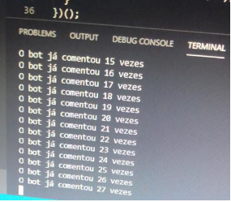
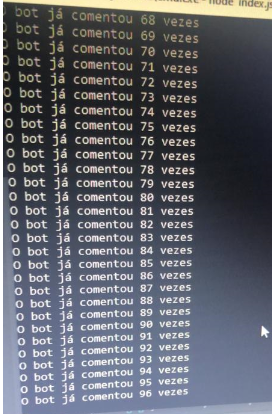
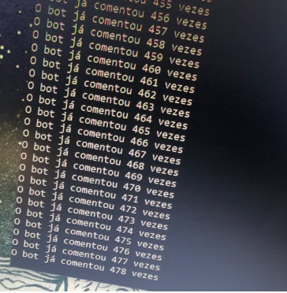

<h2> Instagram Bot - Winning giveaways </h2>  
<h4>I used puppeteer in order to get instagram page, so I can manipulate DOM elements.</h3>
<h4>I also used just pure javascript, because instagrams page dont use jQuery, and i didnt want to inject jQuery's lib.</h4>

### Getting started - Backend
`npm install` 
`yarn start`

### :warning: I recommend that you dont use your personal account

### Put your username
`await page.type('input[name="username"]', "yourusername"`
### Put your password
`await page.type('input[name="password"', "yourpassword", { delay: 200 })`
### Put the link of the post on Instagram
`await page.goto("link")`
### Put the person that you want comment(use @) or a comment, in order to win the giveaway
`await page.type("textarea", "your comment", { delay: 200 });`
### To start commenting:
`node index.js`
